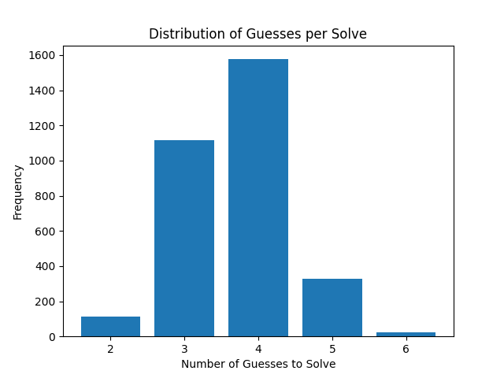
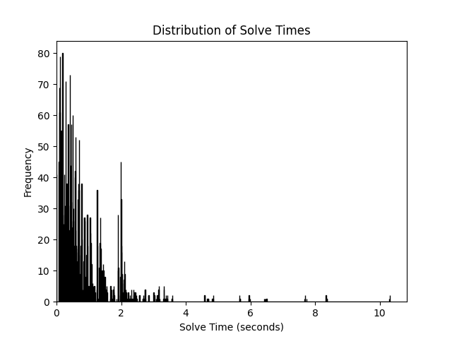

# WordleBot

WordleBot is an intelligent Wordle solver and analyzer. It efficiently simulates solving the daily Wordle using feedback logic, optimised guessing strategies, and recursive search algorithms.

**Performance metrics (full answer pool):**
- Mean turns to solve:   **3.693**
- Min solve time:        **0.002 sec**
- Median solve time:     **0.524 sec**
- Max solve time:        **10.325 sec**

---

## 🔧 Features

- Solve the official Wordle of the day (automatically fetched)
- Solve a random word
- Solve a user-specified word that is a valid answer

---

## 📈 Sample Analytics

### Distribution of Guesses per Solve


### Distribution of Solve Times


---

## 🚀 Usage

### 🐍 Run Solver

```bash
python main.py               # Fetch and solve the official daily Wordle
python main.py random        # Solve a random word 
python main.py <5-letter>    # Solve a specific word (e.g. "crane")
